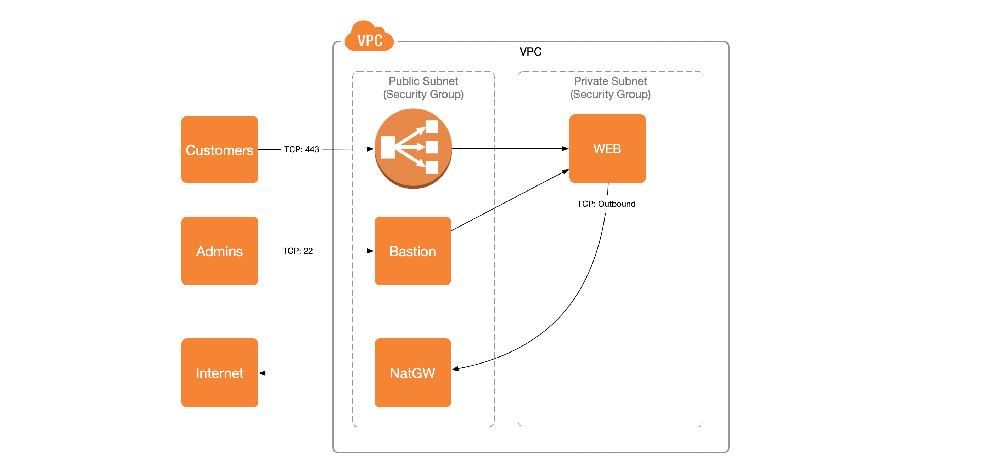
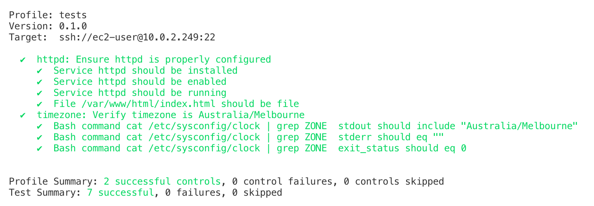
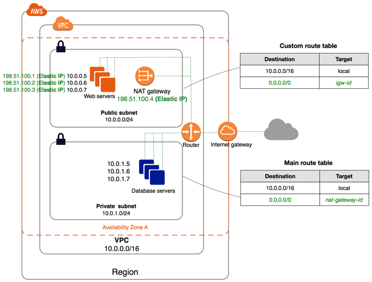
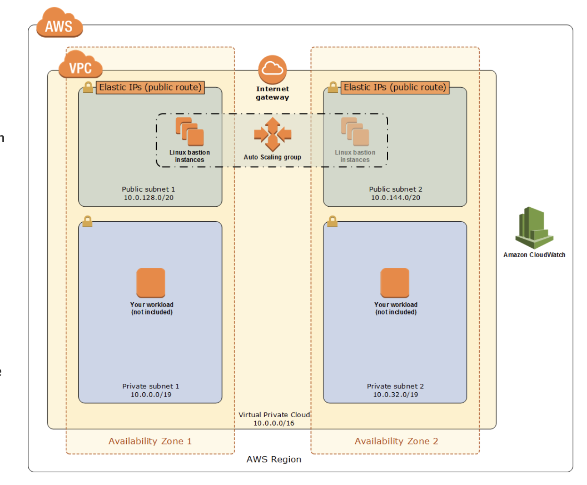

# CloudOps Challenge

This repository contains Cloudformation templates to deploy the application shown below. This is an artifact from a code challenge and is not suitable for production use.



# Quickstart

## Deployment
```bash
# Set your AWS creentials: https://docs.aws.amazon.com/amazonswf/latest/awsrbflowguide/set-up-creds.html
export AWS_ACCESS_KEY_ID=''
export AWS_SECRET_ACCESS_KEY=''

# Set the HTML that you would like to serve
# Format: 'http://<bucket-name>.<region>.amazonaws.com/<file-name>.html'
export INDEX_HTML_SOURCE=''

export AWS_DEFAULT_REGION="ap-southeast-2"
export KEY_NAME="my-key"
export STACK_NAME="code-challenge"
export REMOTE_ACCESS_CIDR="$(curl -s ifconfig.co)/32"

# This will create an create-key-pair, add it to ~/.ssh and deploy the Cloudformation stack.
aws ec2 create-key-pair --key-name $KEY_NAME --query 'KeyMaterial'  --output text > ~/.ssh/$KEY_NAME && \
chmod 600 ~/.ssh/$KEY_NAME && \
aws cloudformation deploy --template-file ./master.yaml \
    --stack-name $STACK_NAME \
    --parameter-overrides \
        IndexHTMLSource=$INDEX_HTML_SOURCE  \
        RemoteAccessCIDR=$REMOTE_ACCESS_CIDR \
        KeyName=$KEY_NAME
```

## Browse the website
```bash
LoadBalancerDNSName=$(aws cloudformation \
    describe-stacks \
    --stack-name $STACK_NAME \
    --query "Stacks[0].Outputs[?OutputKey=='LoadBalancerDNSName'].OutputValue" \
    --output text)

curl $LoadBalancerDNSName
```

## Administration
To administer the web server using ssh, you must first connect to the bastion host and then "jump" to the web server.
```bash
BastionIP=$(aws cloudformation \
    describe-stacks \
    --stack-name $STACK_NAME \
    --query "Stacks[0].Outputs[?OutputKey=='BastionExternalIP'].OutputValue" \
    --output text)

ssh -i ~/.ssh/$KEY_NAME ec2-user@$BastionIP
```

## Tests
You can validate the server configuration by running [Inspec](https://www.inspec.io/downloads/).
```bash
BastionExternalIP=$(aws cloudformation \
    describe-stacks \
    --stack-name $STACK_NAME \
    --query "Stacks[0].Outputs[?OutputKey=='BastionExternalIP'].OutputValue" \
    --output text)

WebPrimaryPrivateIpAddress=$(aws cloudformation \
    describe-stacks \
    --stack-name $STACK_NAME \
    --query "Stacks[0].Outputs[?OutputKey=='WebPrimaryPrivateIpAddress'].OutputValue" \
    --output text)

inspec exec tests/ \
        -t ssh://ec2-user@$WebPrimaryPrivateIpAddress \
        -p 22 \
        -i ~/.ssh/$KEY_NAME \
        --bastion-host=$BastionExternalIP \
        --bastion-port=22 \
        --bastion-user=ec2-user
```

If the tests are succesful, you will see 7 successful tests:


## Deletion
```bash
aws cloudformation delete-stack --stack-name $STACK_NAME
aws ec2 delete-key-pair --key-name $KEY_NAME
rm ~/.ssh/$KEY_NAME
```

# Requirements
## Infra:
- A dedicated VPC with a public and private subnet.
- An EC2 in the private subnet with the following configuration
- Timezone of the machine set to AEST
- Install and run httpd as a service
- Download the file belong-test.html from S3 Bucket (belong-coding-challenge) in Sydney region and service it through httpd.

## Access:
- Developers require SSH access to the EC2 for further configuration / administration.
- Access is required to the site serving the page belong-test.html

## Notes:
- IaC tool of choice is Cloudformation.

## Ranking
- Problem solving approach
- Simplicity
- Code quality
- Use of Cloud best practices

## References
https://docs.aws.amazon.com/AWSEC2/latest/UserGuide/ec2-best-practices.html
https://docs.aws.amazon.com/AWSEC2/latest/UserGuide/set-time.html
https://docs.aws.amazon.com/AWSCloudFormation/latest/UserGuide/best-practices.html
https://docs.aws.amazon.com/AWSCloudFormation/latest/UserGuide/GettingStarted.Walkthrough.html
https://s3-us-west-2.amazonaws.com/cloudformation-templates-us-west-2/WordPress_Single_Instance.yaml

## Reference Diagrams


